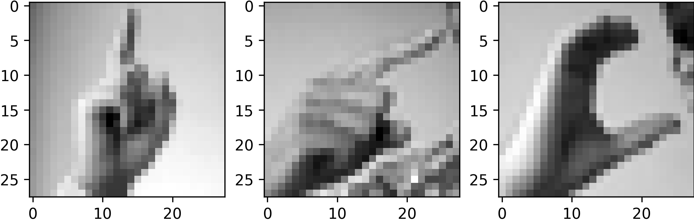
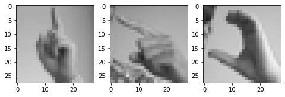
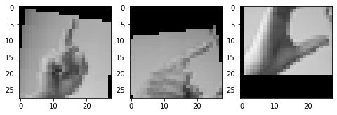
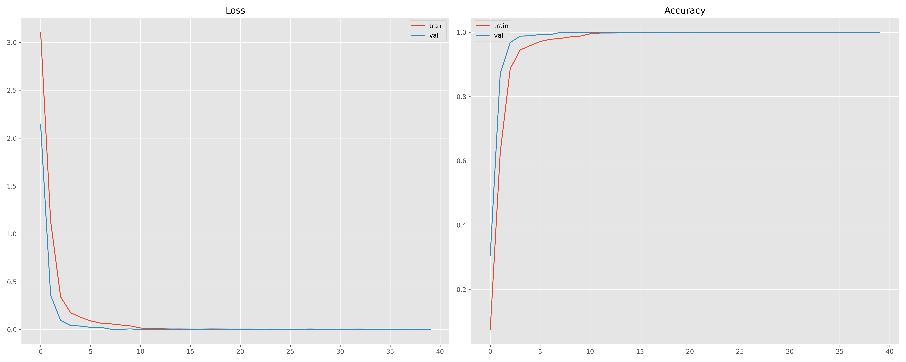

# Hand Gesture Recognition

In this project, we would develop a hand gesture recognition application using neural networks. It would be helpful for many areas: disability assistant, games, etc.

## Dataset

We're using the [Sign Language MNIST](https://www.kaggle.com/datamunge/sign-language-mnist) dataset from Kaggle.

- The dataset format is patterned to match closely with the classic MNIST.

- Each training and test case represents a label (0-25) as a one-to-one map for each alphabetic letter A-Z (and NO cases for `9=J` or `25=Z` because of gesture motions).

  

- The training data (27,455 cases) and test data (7172 cases) are approximately half the size of the standard MNIST but otherwise similar with a header row of label, pixel1,pixel2….pixel784 which represent a single 28x28 pixel image with grayscale values between 0-255.

  

## Install dependencies

```bash
pip install -r requirements.txt
```

## Download datasets

```bash
wget http://i13pc106.ira.uka.de/~tha/PNNProjects/sign-language-mnist.zip
mkdir data
unzip sign-language-mnist.zip -d data/
rm sign-language-mnist.zip
```

## Data augmentation

Data augmentation is applied before training. For example:

Original images



Random horizontal flip:



Random affine:



## Training

Implmentation of models can be found in folder `models/`.

Configuration (including dataset path, hyperparameters, etc) is defined in `config.yaml`.

To start training, 

1. Launch Tensorboard

   ```bash
   tensorboard --logdir=runs/sign_languange
   ```

2. Create another terminal session and run

   ```bash
   python train.py
   ```

3. Open browser, navigate to [https://localhost:6006](https://localhost:6006/) to monitor training.

After training, the best model will be saved in `saved_models/`.

## Evaluation

To evaluate the trained model on the test set, run

```bash
python test.py -m <trained-model>
```

## Results

Training a simple neural network (3 convolutional layers + 3 Fully Connected (FC) layer) using SGD with momentum for 40 epochs:



After training, the model can achieve **98.2432%** accuracy on the test set. 

